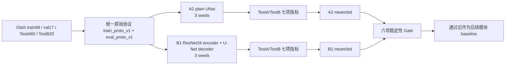
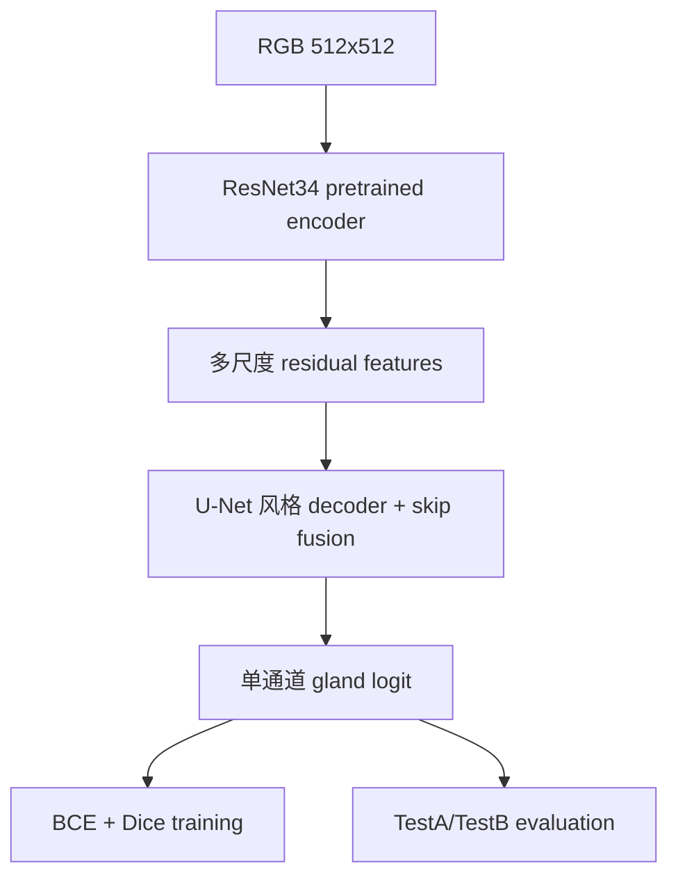

# 04_Baseline：UNet 与 ResNet34-UNet 阶段总结

> 本文是面向项目成员和论文写作的中文总结。所有结果数字均从六个正式 run 的 TestA/TestB 原始 CSV 重新计算，使用三 seed population standard deviation，即 `ddof=0`。本文不修改任何实验结果文件。

## 1. 先看结论

### 1.1 当前阶段是否有效

| 项目 | 结论 |
|---|---|
| A2 UNet 三个 seed | 训练和测试资产有效 |
| B1 ResNet34-UNet 三个 seed | 修复数值问题后重新训练，训练和测试资产有效 |
| A2/B1 训练协议 | 成对使用 `train_proto_v1` |
| A2/B1 评估协议 | 成对使用 `eval_proto_v1` |
| B1 与 A2 的科学变量 | 只改变 encoder 结构；B1 使用 ResNet34 encoder，decoder 和分割头保持 U-Net 风格 |
| 六项稳定性 Gate | 全部通过 |
| B1 mean 性能 | TestA/TestB 的七项报告指标均优于 A2，距离指标越低越好 |
| 当前状态 | B1 可以作为后续模块实验的正式 baseline |

### 1.2 “全部指标通过”应该怎样理解

本阶段一共报告七项指标：

```text
F1
Object Dice
Object Hausdorff
Dice
IoU
HD95
Boundary F1
```

其中项目预注册的严格稳定性 Gate 只检查六个单元：

```text
{F1, Object Dice, Object Hausdorff} × {TestA, TestB}
```

这六项要求：

```text
B1 的三 seed std <= A2 的三 seed std
```

本次六项全部满足，所以可以严格写成：

> B1 在预注册的六项主稳定性单元上全部通过，且三 seed 的跨种子波动不高于 A2。

Dice、IoU、HD95 和 Boundary F1 仍然全部真实计算、全部报告并且数值有效，但当前阶段没有为这四项另设独立的“必须小于 A2 std”的硬 Gate。因此不应把它们写成“另有独立 Gate 也通过”，而应写成“补充指标完整报告，结果见表格”。

## 2. A2 和 B1 分别是什么

### 2.1 A2：普通 UNet 内部对照

A2 是项目内部的 plain UNet 稳定基线，不是外部方法对比。它的作用是提供一个结构简单、可解释、可重复的 control：

```text
输入 RGB 图像
→ UNet encoder/decoder
→ skip connection
→ 单通道 gland segmentation logit
```

A2 的结构依据是 U-Net 的经典 encoder-decoder 和 skip connection 思路。工程实现位于 `src/models/unet.py`，模型配置位于 `configs/model/unet_v1.yaml`。

### 2.2 B1：ResNet34-UNet 结构 baseline

B1 是在 A2 基础上的结构升级：

```text
plain UNet encoder
→ ResNet34 residual encoder
```

decoder 仍然是 U-Net 风格的上采样、skip fusion 和卷积 refinement，输出仍然是单通道分割 logit。B1 的结构实现位于 `src/models/resnet34_unet.py`，模型配置位于 `configs/model/resnet34_unet.yaml`。

B1 使用 torchvision 的 ImageNet-1K ResNet34 预训练初始化。这是 B1 模型结构和初始化定义的一部分，不是针对某个 seed 的结果调参，也不是 v2/v3 训练协议。

## 3. 原始冻结协议

A2 和 B1 共享下面所有数据、训练和评估设置：

| 类别 | 冻结值 |
|---|---|
| 数据集 | GlaS |
| 数据划分 | `train68 / val17 / TestA60 / TestB20` |
| 输入 | RGB，`512 x 512` |
| 归一化 | ImageNet mean/std |
| 训练增强 | `light_aug_v1` |
| 训练 loss | BCE + Dice |
| optimizer | AdamW |
| learning rate | `1e-3` |
| weight decay | `1e-4` |
| scheduler | ReduceLROnPlateau |
| scheduler monitor | `val_objdice` |
| 最大 epoch | 120 |
| early stopping | patience 20 |
| batch size | 2 |
| AMP | true |
| best selector | `val_objdice` 最大值 |
| threshold | 0.5 |
| threshold source | val17 |
| 测试方式 | TestA、TestB 分开报告 |
| seeds | 3407、1234、2025 |
| 评估协议 | `eval_proto_v1` |
| 后处理 | none in v1 |
| 连通域 | `scipy.ndimage.label`，8-connectivity |
| 边界宽度 | 3 px |
| 统计 | 三 seed population std，`ddof=0` |

### 3.1 明确没有使用的后续变量

本轮没有使用：

- v2 差分学习率，例如 encoder `1e-4`、decoder `1e-3`；
- v3 encoder BN running statistics freezing；
- GroupNorm；
- gradient accumulation；
- LKMA；
- Boundary head；
- Distance head；
- TTA；
- 额外后处理；
- 重新调 threshold；
- 删除某个 seed 或合并 TestA/TestB。

六个正式 run 的 `run_meta.yaml` 均显示：`train_proto_v1`、`eval_proto_v1`、`lr=0.001`、`batch_size=2`、`amp=true`、`threshold=0.5`，并且 B1 的 `bn_policy_version=not_applicable`。

## 4. 参数和模型为什么这样设定

### 4.1 UNet 的依据

U-Net 是医学图像分割中的经典 encoder-decoder 基线。它通过：

1. encoder 逐步压缩空间分辨率、提取上下文；
2. decoder 逐步恢复空间分辨率；
3. skip connection 将浅层边界信息传给 decoder；
4. 单通道 logit 完成二值腺体分割。

项目中的 A2 实现保留了标准、可解释的结构，不提前加入 attention、residual encoder 或多任务分支，便于作为内部 control。

### 4.2 ResNet34 encoder 的依据

ResNet34 通过 residual block 让较深的 encoder 更容易优化，并且 ImageNet 预训练权重提供了成熟的视觉特征初始化。将它放入 U-Net encoder 位置，可以在保持 U-Net decoder/skip 分割框架的同时，测试更强 encoder 是否改善腺体对象级分割。

因此 B1 的研究问题是：

> 在数据、loss、optimizer、学习率、batch、AMP、checkpoint、threshold 和评估完全不变时，仅把 plain UNet encoder 换成 ResNet34 residual encoder，性能和跨 seed 稳定性是否改善？

### 4.3 为什么不为 B1 单独调参

如果 B1 同时改变 learning rate、loss 或 BN policy，就无法判断提升来自 ResNet34 结构还是训练配方。原始计划把 B1 定义为结构 baseline，因此所有训练侧设置继承 A2，只允许做必要的通道和尺寸适配。

## 5. 实验代码是怎样来的

### 5.1 训练入口

正式训练由 `scripts/train.py` 调用配置，训练器位于 `src/engine/trainer.py`。配置通过以下引用链进入运行：

```text
configs/experiment/A2...yaml 或 B1...yaml
→ configs/data/glas.yaml
→ configs/model/unet_v1.yaml 或 resnet34_unet.yaml
→ configs/train/unet_flow_v1.yaml
→ configs/eval/eval_proto_v1.yaml
→ scripts/train.py / scripts/test.py
```

### 5.2 代码依据

| 代码对象 | 作用 | 依据 |
|---|---|---|
| `src/models/unet.py` | plain UNet | U-Net encoder-decoder + skip connection |
| `src/models/resnet34_unet.py` | ResNet34 encoder + U-Net decoder | ResNet residual encoder、torchvision ResNet34 API、04_Baseline 结构协议 |
| `src/engine/trainer.py` | loss、AMP、backward、optimizer、validation、checkpoint、early stopping | 原始训练协议和项目训练链 |
| `scripts/train.py` | 解析实验配置、构建模型和数据、启动训练 | 项目正式训练入口 |
| `scripts/test.py` | 加载 best checkpoint，分别测试 TestA/TestB | `eval_proto_v1` |
| `scripts/run_baseline_sequential.sh` | 按 seed 串行训练和完成性检查 | 三 seed 重复设计、fresh 归档规则 |

### 5.3 本轮发现并修复的工程问题

早期 B1 失败不是模型性能差，而是训练入口曾根据 `stage_code=B1` 隐式打开 v3 BN policy，导致原始 v1 训练协议被偷偷改变；同时训练器没有在 loss、gradient 和 validation metric 非有限时立即阻断。

本轮修复为：

- BN policy 改为只由模型配置显式决定；当前 B1 的 v1 配置为 `bn_policy_enabled=false`；
- training loss 非 finite 时立即失败；
- gradient 非 finite 时立即失败；
- 正式 validation metric 非 finite 时立即失败；
- 完成性检查增加 CSV finite、checkpoint finite 和 smoke 排除；
- B1 model identity 统一为 `r34_unet_v1`。

修复后重新完成了 B1 runtime 和 smoke，随后重新训练 B1 三个 seed。旧 B1 NaN 结果已经排除，不进入本次比较。

## 6. 运行资产审查

六个正式 run 均完成以下检查：

- `run_meta.yaml` 身份字段正确；
- train/val CSV 存在，epoch 连续；
- train/val 数值 finite；
- best.ckpt 和 last.ckpt 存在；
- checkpoint 模型权重 finite；
- TestA 60 行，TestB 20 行；
- 七项测试指标存在且 finite；
- predictions、visuals、error cases 存在；
- `metric_crosscheck_note.md` 存在并通过；
- best checkpoint SHA256 可回链到 `run_meta.yaml`；
- A2/B1 的正式身份未混入历史 v2/v3 结果。

## 7. 最终实验结果

下面的 mean/std 均由三份正式 run 的 sample-level CSV 重新计算：先计算每个 seed 在一个 split 上的样本均值，再对三个 seed 的均值计算 mean 和 population std，`ddof=0`。

### 7.1 TestA

| 指标 | A2 mean | A2 std | B1 mean | B1 std | 方向 |
|---|---:|---:|---:|---:|---|
| F1 | 0.566538 | 0.072263 | 0.745817 | 0.066436 | 越高越好 |
| Object Dice | 0.748736 | 0.035503 | 0.836899 | 0.031308 | 越高越好 |
| Object Hausdorff | 109.680022 | 14.704206 | 67.296675 | 12.788273 | 越低越好 |
| Dice | 0.886468 | 0.017127 | 0.911215 | 0.008179 | 越高越好 |
| IoU | 0.805116 | 0.026353 | 0.844455 | 0.012785 | 越高越好 |
| HD95 | 51.961495 | 5.804559 | 34.755877 | 2.347987 | 越低越好 |
| Boundary F1 | 0.664655 | 0.045450 | 0.754139 | 0.025971 | 越高越好 |

### 7.2 TestB

| 指标 | A2 mean | A2 std | B1 mean | B1 std | 方向 |
|---|---:|---:|---:|---:|---|
| F1 | 0.581742 | 0.058055 | 0.701112 | 0.034223 | 越高越好 |
| Object Dice | 0.782979 | 0.020334 | 0.819051 | 0.014055 | 越高越好 |
| Object Hausdorff | 118.607127 | 11.268664 | 99.286850 | 5.007488 | 越低越好 |
| Dice | 0.879743 | 0.011181 | 0.899048 | 0.012852 | 越高越好 |
| IoU | 0.795918 | 0.015574 | 0.829609 | 0.016179 | 越高越好 |
| HD95 | 43.426340 | 4.780118 | 32.541451 | 2.911827 | 越低越好 |
| Boundary F1 | 0.627416 | 0.020382 | 0.699706 | 0.002082 | 越高越好 |

### 7.3 稳定性 Gate 逐项结果

| Split | 指标 | A2 std | B1 std | 判定 |
|---|---|---:|---:|---|
| TestA | F1 | 0.072263 | 0.066436 | pass |
| TestA | Object Dice | 0.035503 | 0.031308 | pass |
| TestA | Object Hausdorff | 14.704206 | 12.788273 | pass |
| TestB | F1 | 0.058055 | 0.034223 | pass |
| TestB | Object Dice | 0.020334 | 0.014055 | pass |
| TestB | Object Hausdorff | 11.268664 | 5.007488 | pass |

严格结论：B1 的六项稳定性 std 全部小于 A2，因此本阶段的稳定性 Gate 通过。补充指标 Dice、IoU、HD95、Boundary F1 已全部报告，但不把它们额外包装成未预注册的硬 Gate。

## 8. 图示

### 8.1 模型和实验关系



### 8.2 B1 结构变化



### 8.3 论文中可以画的柱状图

论文正式作图时建议使用上面的结果表生成两类柱状图，而不是手动画数字：

1. TestA/TestB 的 F1、Object Dice、Dice、IoU、Boundary F1：A2 与 B1 分组柱状图，误差棒为三 seed std；
2. TestA/TestB 的 Object Hausdorff、HD95：A2 与 B1 分组柱状图，误差棒为三 seed std，纵轴方向解释为越低越好。

当前仓库已有的真实作图数据源是六个 run 的：

```text
experiments/A2_UNet_GlaS_seed3407/testA_metrics.csv
experiments/A2_UNet_GlaS_seed1234/testA_metrics.csv
experiments/A2_UNet_GlaS_seed2025/testA_metrics.csv
experiments/B1_ResNet34_UNet_GlaS_seed3407/testA_metrics.csv
experiments/B1_ResNet34_UNet_GlaS_seed1234/testA_metrics.csv
experiments/B1_ResNet34_UNet_GlaS_seed2025/testA_metrics.csv
```

TestB 使用同样的六个目录和 `testB_metrics.csv`。

## 9. 论文写作建议

### 9.1 方法部分

可以写：

> We first established a plain U-Net control (A2) and then replaced only its encoder with an ImageNet-pretrained ResNet34 encoder to construct the B1 ResNet34-U-Net baseline. The decoder, segmentation head, data split, input resolution, normalization, augmentation, loss, optimizer, learning rate, batch size, AMP setting, checkpoint selection, threshold, and evaluation protocol were kept identical between A2 and B1.

中文含义是：A2 和 B1 所有训练/评估设置一致，B1 只把 encoder 换成 ResNet34。

### 9.2 结果部分

可以写：

> Across both TestA and TestB, B1 improved all seven reported metrics in mean performance compared with A2, while the six pre-registered stability units based on F1, Object Dice, and Object Hausdorff all showed no larger cross-seed variation than A2.

中文含义是：B1 在两个测试子集的七项报告指标均值均优于 A2，并且预注册的六项稳定性单元全部通过。

### 9.3 不建议写的内容

不建议写：

- “所有七项指标都通过了稳定性 Gate”，因为当前硬 Gate 只定义了六项主稳定性单元；
- “B1 完全没有任何代码改动”，因为 B1 必然有 encoder、通道和 skip 的工程适配；
- “B1 与 A2 使用完全相同的模型”，因为它们的 encoder 明确不同；
- “结果证明最终模型一定优于所有外部方法”，因为 A2/B1 是内部 baseline，外部比较应放在后续完整模型与公开方法的对照中；
- 使用旧 B1 NaN 轮次的结果，或把 v2/v3 历史结果混入当前表格。

## 10. 证据路径

### 原始计划

- `结直肠腺体分割_plan_优化版/01_实验执行/04_Baseline/00_阶段总协议.md`
- `结直肠腺体分割_plan_优化版/01_实验执行/04_Baseline/01_R34UNet结构与来源.md`
- `结直肠腺体分割_plan_优化版/01_实验执行/04_Baseline/02_训练协议.md`
- `结直肠腺体分割_plan_优化版/01_实验执行/04_Baseline/03_对比与判断规则.md`
- `结直肠腺体分割_plan_优化版/01_实验执行/04_Baseline/04_阶段验收.md`

### 当前代码与配置

- `crc_gland_segmentation_project/src/models/unet.py`
- `crc_gland_segmentation_project/src/models/resnet34_unet.py`
- `crc_gland_segmentation_project/src/engine/trainer.py`
- `crc_gland_segmentation_project/scripts/train.py`
- `crc_gland_segmentation_project/scripts/test.py`
- `crc_gland_segmentation_project/configs/train/unet_flow_v1.yaml`
- `crc_gland_segmentation_project/configs/eval/eval_proto_v1.yaml`
- `crc_gland_segmentation_project/configs/model/unet_v1.yaml`
- `crc_gland_segmentation_project/configs/model/resnet34_unet.yaml`

### 正式结果

- `crc_gland_segmentation_project/experiments/A2_UNet_GlaS_seed3407/`
- `crc_gland_segmentation_project/experiments/A2_UNet_GlaS_seed1234/`
- `crc_gland_segmentation_project/experiments/A2_UNet_GlaS_seed2025/`
- `crc_gland_segmentation_project/experiments/B1_ResNet34_UNet_GlaS_seed3407/`
- `crc_gland_segmentation_project/experiments/B1_ResNet34_UNet_GlaS_seed1234/`
- `crc_gland_segmentation_project/experiments/B1_ResNet34_UNet_GlaS_seed2025/`

## 11. 最终边界

本阶段可以得出的结论是：

```text
A2 是有效的 plain UNet 内部对照。
B1 是有效的 ResNet34-UNet 结构 baseline。
B1 与 A2 共享原始 train/eval protocol。
B1 只改变 encoder 结构和必要的连接适配。
B1 七项报告指标均值优于 A2。
B1 预注册的六项稳定性 Gate 全部通过。
```

本阶段不能得出的结论是：

```text
B1 已经优于所有外部论文方法。
B1 已经是最终完整模型。
后续 LKMA、Boundary、Distance 一定提升。
七项指标都各自拥有独立硬 Gate 且全部通过。
```

后续模块实验应以 B1 作为固定 baseline，继续保持三 seed、TestA/TestB 分开、相同统计口径和真实资产审计。
